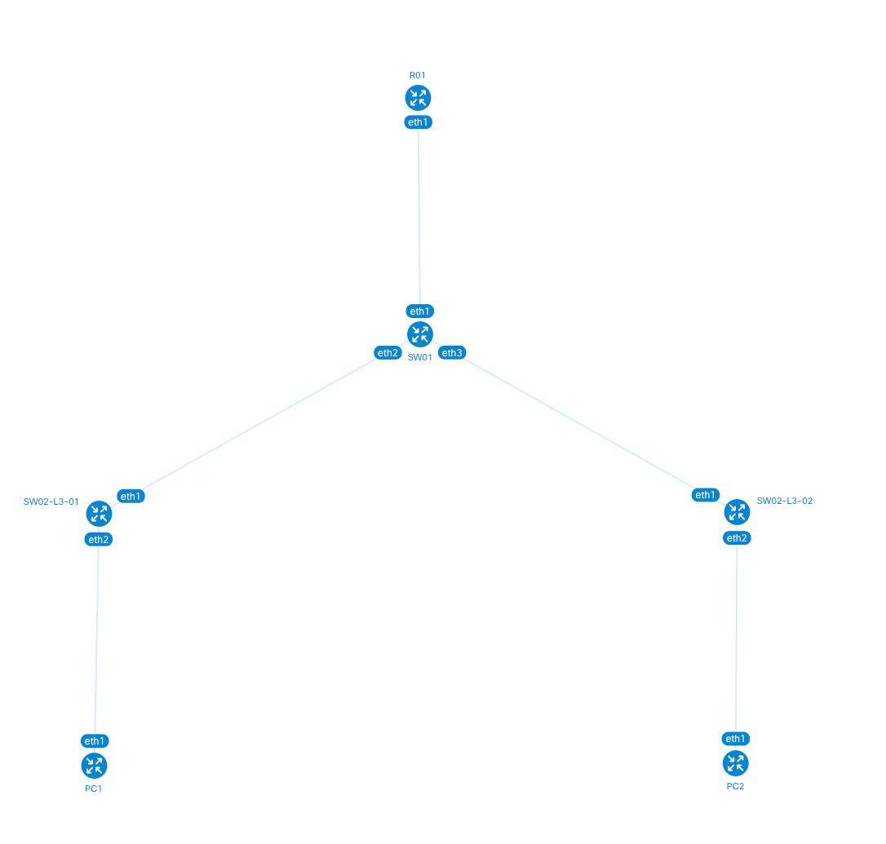

University: [ITMO University](https://itmo.ru/ru/)  
Faculty: [FICT](https://fict.itmo.ru)  
Course: [Introduction in routing](https://github.com/itmo-ict-faculty/introduction-in-routing)  
Year: 2025/2026  
Group: K3323  
Author: Ivanova Ekaterina Andreevna  
Lab: Lab1  
Date of creation: 07.09.2025  
Date of finish: 31.12.2025

## Лабораторная работ №1 "Установка ContainerLab и развертывание тестовой сети связи"

### Полезные ресурсы

- [Simple deployment of a container-based network lab](https://habr.com/ru/articles/682974/)

### Описание
В данной лабораторной работе вы познакомитесь с инструментом ContainerLab, развернете тестовую сеть связи, настроите оборудование на базе Linux и RouterOS.

### Задачи

1. Построить трехуровневую корпоративную сеть связи в ContainerLab
2. Настроить IP-адреса на интерфейсах и создать два VLAN на ПК
3. Создать два DHCP-сервера на центральном маршрутизаторе в ранее созданных VLAN для распределения IP-адресов
4. Настроить имена устройств (hostnames) и изменить логины и пароли


### Ход работы

#### Подготовка

- Установим `Docker` и запустим engine
  [Manual for Ubuntu](https://docs.docker.com/engine/install/ubuntu/)  

- Установим `make`

    ```commandline
    sudo apt install make
    make --version
    ```

- Склонируем `hellt/vrnetlab`

    ```commandline
    git clone https://github.com/srl-labs/vrnetlab.git
    ```

- Скопируем `vrnetlab/mikrotik/routeros` VDM с MikroTik RouterOS

    ```commandline
    scp ~/Downloads/chr-6.47.9.vmdk ~/vrnetlab/mikrotik/routeros
    ```

- Создадим образ

    ```commandline
    make docker-image
    ```

- Установим ContainerLab

    ```commandline
    curl -sL https://containerlab.dev/setup | sudo -E bash -s "all"
    ```

- Запустим команду, чтобы обеспечить sudo-less docker 

    ```commandline
    newgrp docker
    ```

#### Базовая конфигурация

Для начала напишем базовый *.clab.yml файл, где создадим наши устройства и укажем связи между ними

```commandline
name: tplg1

topology:
 nodes:
  R01.TEST:
   kind: vr-ros
   image: vrnetlab/mikrotik_routeros:6.47.9
  
    SW01.L3.01.TEST:
   kind: vr-ros
   image: vrnetlab/mikrotik_routeros:6.47.9
   
  SW02.L3.01.TEST:
   kind: vr-ros
   image: vrnetlab/mikrotik_routeros:6.47.9
   
  SW02.L3.02.TEST:
   kind: vr-ros
   image: vrnetlab/mikrotik_routeros:6.47.9
   
  PC1:
   kind: linux
   image: alpine:latest
   
  PC2:
   kind: linux
   image: alpine:latest
   
 links:
  - endpoints: ["R01.TEST:eth1", "SW01.L3.01.TEST:eth1"]
  - endpoints: ["SW01.L3.01.TEST:eth2", "SW02.L3.01.TEST:eth1"]
  - endpoints: ["SW01.L3.01.TEST:eth3", "SW02.L3.02.TEST:eth1"]
  - endpoints: ["SW02.L3.01.TEST:eth2", "PC1:eth1"]
  - endpoints: ["SW02.L3.02.TEST:eth2", "PC2:eth1"]
```

Созданы 4 контейнера типа vr-ros на базе скачанного ранее образа, а также 2 ПК на базе alpine
Дополнительно указаны связи между всеми устройствами согласно схеме из задания

#### Создание mgmt-сети

mgmt-сеть (managed network) - это изолированная вспомогательная сеть управления, через которую мы будем подключаться к нашим контейнерам

Пропишем каждому устройству его статический ipv4-адрес:

```commandline
 nodes:
  R01.TEST:
   kind: vr-ros
   image: vrnetlab/mikrotik_routeros:6.47.9
      mgmt_ipv4: 172.20.20.11
  
    SW01.L3.01.TEST:
   kind: vr-ros
   image: vrnetlab/mikrotik_routeros:6.47.9
      mgmt_ipv4: 172.20.20.21
   
  SW02.L3.01.TEST:
   kind: vr-ros
   image: vrnetlab/mikrotik_routeros:6.47.9
      mgmt_ipv4: 172.20.20.31
   
  SW02.L3.02.TEST:
   kind: vr-ros
   image: vrnetlab/mikrotik_routeros:6.47.9
      mgmt_ipv4: 172.20.20.32
   
  PC1:
   kind: linux
   image: alpine:latest
      mgmt_ipv4: 172.20.20.41
   
  PC2:
   kind: linux
   image: alpine:latest
      mgmt_ipv4: 172.20.20.42
```

Попробуем задеплоить нашу сеть командой `clab deploy -t tplg1.clab.yml`

Получаем WARNING 
```commandline
15:57:11 WARN Node name will not resolve via DNS name=clab-tplg1-R01.TEST reason="name contains invalid characters such as '.' and/or '_'"
15:57:11 WARN Node name will not resolve via DNS name=clab-tplg1-SW01.L3.01.TEST reason="name contains invalid characters such as '.' and/or '_'"
15:57:11 WARN Node name will not resolve via DNS name=clab-tplg1-SW02.L3.01.TEST reason="name contains invalid characters such as '.' and/or '_'"
15:57:11 WARN Node name will not resolve via DNS name=clab-tplg1-SW02.L3.02.TEST reason="name contains invalid characters such as '.' and/or '_'"
```

Переименуем наши ноды, убрав точки и снова задеплоим нашу сеть 
```commandline
sudo containerlab destroy -t tplg1.clab.yml
sudo containerlab deploy -t tplg1.clab.yml
```

Проверим состояние сети
```commandline
sudo containerlab inspect -t tplg1.clab.yml 
```


#### Настройка конфигураций

Для каждого устройства создадим конфиг файл

Для R01:

- Смена имени устройства, логина и пароля:
  
  ```commandline
  /system identity set name=R01 # задаем имя устройства
  /user set 0 name=kate password=123 # изменяем креды встроенного пользователя
  ```

- VLAN-интерфейсы и ip адреса на них

  ```commandline
  /interface vlan
  add name=vlan10 interface=eth2 vlan-id=10
  add name=vlan20 interface=eth3 vlan-id=20

  /ip address
  add address=192.168.10.1/24 interface=vlan10
  add address=192.168.20.1/24 interface=vlan20
  ```

- DHCP серверы и диапазоны адресов

  ```commandline
  /ip pool # определяем диапазоны адресов, которые будут раздаваться
  add name=pool_vlan10 ranges=192.168.10.10-192.168.10.100 
  add name=pool_vlan20 ranges=192.168.20.10-192.168.20.100

  /ip dhcp-server # создаем dhcp-серверы на каждом VLAN
  add name=dhcp_vlan10 interface=vlan10 address-pool=pool_vlan10
  add name=dhcp_vlan20 interface=vlan20 address-pool=pool_vlan20

  /ip dhcp-server enable dhcp_vlan10 # активируем dhcp-сервера
  /ip dhcp-server enable dhcp_vlan20
  ```

Для SW01:

- Смена имени устройства, логина и пароля:
  
  ```commandline
  /system identity set name=SW01
  /user set 0 name=kate password=123
  ```

Добавим `startup-config` в файл с топологией и пересоберем сеть командой 
```commandline
sudo containerlab redeploy -t tplg1.clab.yml 
```


#### Схема сети
Создадим схему созданной сети командой 
```commandline
containerlab graph -t tplg1.clab.yml
```


Отлично, граф соответствует схеме из задания 

#### Проверка связности
Подключимся к PC1 и попробуем отправить пинг на PC2
```commandline
docker exec -it clab-tplg1-PC1 sh
```

```commandline
/ # ping -c 5 10.20.0.1
PING 10.20.0.1 (10.20.0.1): 56 data bytes
64 bytes from 10.20.0.1: seq=0 ttl=64 time=3.275 ms
64 bytes from 10.20.0.1: seq=1 ttl=64 time=2.112 ms
64 bytes from 10.20.0.1: seq=2 ttl=64 time=2.326 ms
64 bytes from 10.20.0.1: seq=3 ttl=64 time=2.092 ms
64 bytes from 10.20.0.1: seq=4 ttl=64 time=2.204 ms

--- 10.20.0.1 ping statistics ---
5 packets transmitted, 5 packets received, 0% packet loss
round-trip min/avg/max = 2.092/2.401/3.275 ms
```
Теперь отправим пинг с PC2 на PC2

```commandline
docker exec -it clab-tplg1-PC2 sh
```

```commandline
/ # ping -c 5 10.20.0.2
PING 10.20.0.2 (10.20.0.2): 56 data bytes
64 bytes from 10.20.0.2: seq=0 ttl=64 time=3.287 ms
64 bytes from 10.20.0.2: seq=1 ttl=64 time=1.490 ms
64 bytes from 10.20.0.2: seq=2 ttl=64 time=1.614 ms
64 bytes from 10.20.0.2: seq=3 ttl=64 time=1.455 ms
64 bytes from 10.20.0.2: seq=4 ttl=64 time=1.335 ms

--- 10.20.0.2 ping statistics ---
5 packets transmitted, 5 packets received, 0% packet loss
round-trip min/avg/max = 1.335/1.836/3.287 ms
```
### Вывод

В ходе выполнения лабораторной работы был освоен инструмент ContainerLab и развернута
трехуровневая корпоративная сеть с центральным маршрутизатором и коммутаторами доступа. 
Настроены VLAN, DHCP-серверы для автоматического распределения IP-адресов, а также выполнена 
базовая конфигурация устройств. В результате создана полностью функционирующая сеть с корректной 
маршрутизацией между VLAN и автоматической выдачей IP-адресов оконечным устройствам.