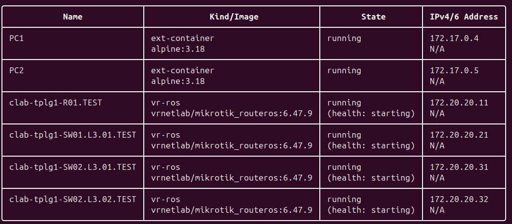

University: [ITMO University](https://itmo.ru/ru/)  
Faculty: [FICT](https://fict.itmo.ru)  
Course: [Introduction in routing](https://github.com/itmo-ict-faculty/introduction-in-routing)  
Year: 2025/2026  
Group: K3323  
Author: Ivanova Ekaterina Andreevna  
Lab: Lab1  
Date of creation: 07.09.2025  
Date of finish:  

## Laboratory Work No. 1: "Installing ContainerLab and Deploying a Test Communication Network"

### Helpful sources
  - [Simple deployment of a container-based network lab](https://habr.com/ru/articles/682974/)
    
### Objective

Become familiar with the ContainerLab tool, study the operation of VLANs, IP addressing, and related concepts

### Tasks
  1. Build a three-tier enterprise communication network in ContainerLab
  2. Configure IP addresses on interfaces and set up two VLANs on the PC
  3. Create two DHCP servers on the central router within the previously created VLANs to distribute IP addresses
  4. Configure device hostnames and change logins and passwords

### Procedure


#### Preliminary Setup

- Install `Docker` and start an engine 
  [Manual for Ubuntu](https://docs.docker.com/engine/install/ubuntu/)  


- Install `make`
    ```commandline
    # sudo apt install make
    # make --version
    ```

- Clone `hellt/vrnetlab`

    ```commandline
    # git clone https://github.com/srl-labs/vrnetlab.git
    ```
- Copy to `vrnetlab/mikrotik/routeros` VDM with MikroTik RouterOS
    ```commandline
    # scp ~/Downloads/chr-6.47.9.vmdk ~/vrnetlab/mikrotik/routeros
    ```
- Create an image
    ```commandline
    # make docker-image
    ```
- Install ContainerLab
    ```commandline
    curl -sL https://containerlab.dev/setup | sudo -E bash -s "all"
    ```
- To enable sudo-less docker command execution run 
    ```commandline
    newgrp docker
    ```

#### Main part

It is required to build a three-tier enterprise network, as shown in Picture 1, using ContainerLab


### Базовая конфигурация

Для начала напишем базовый *.clab.yml файл, где создадим наши устройства и укажем связи между ними

```commandline
name: tplg1

topology:
	nodes:
		R01.TEST:
			kind: vr-ros
			image: vrnetlab/mikrotik_routeros:6.47.9
		
    SW01.L3.01.TEST:
			kind: vr-ros
			image: vrnetlab/mikrotik_routeros:6.47.9
			
		SW02.L3.01.TEST:
			kind: vr-ros
			image: vrnetlab/mikrotik_routeros:6.47.9
			
		SW02.L3.02.TEST:
			kind: vr-ros
			image: vrnetlab/mikrotik_routeros:6.47.9
			
		PC1:
			kind: linux
			image: alpine:latest
			
		PC2:
			kind: linux
			image: alpine:latest
			
	links:
		- endpoints: ["R01.TEST:eth1", "SW01.L3.01.TEST:eth1"]
		- endpoints: ["SW01.L3.01.TEST:eth2", "SW02.L3.01.TEST:eth1"]
		- endpoints: ["SW01.L3.01.TEST:eth3", "SW02.L3.02.TEST:eth1"]
		- endpoints: ["SW02.L3.01.TEST:eth2", "PC1:eth1"]
		- endpoints: ["SW02.L3.02.TEST:eth2", "PC2:eth1"]
```

Созданы 4 контейнера типа vr-ros на базе скачанного ранее образа, а также 2 ПК на базе alpine
Дополнительно указаны связи между всеми устройствами согласно схеме из задания

### Создание mgmt-сети

mgmt-сеть (managed network) - это изолированная вспомогательная сеть управления, через которую мы будем подключаться к нашим контейнерам 

Пропишем каждому устройству его статический ipv4-адрес:

```commandline
	nodes:
		R01.TEST:
			kind: vr-ros
			image: vrnetlab/mikrotik_routeros:6.47.9
      mgmt_ipv4: 172.20.20.11
		
    SW01.L3.01.TEST:
			kind: vr-ros
			image: vrnetlab/mikrotik_routeros:6.47.9
      mgmt_ipv4: 172.20.20.21
			
		SW02.L3.01.TEST:
			kind: vr-ros
			image: vrnetlab/mikrotik_routeros:6.47.9
      mgmt_ipv4: 172.20.20.31
			
		SW02.L3.02.TEST:
			kind: vr-ros
			image: vrnetlab/mikrotik_routeros:6.47.9
      mgmt_ipv4: 172.20.20.32
			
		PC1:
			kind: linux
			image: alpine:latest
      mgmt_ipv4: 172.20.20.41
			
		PC2:
			kind: linux
			image: alpine:latest
      mgmt_ipv4: 172.20.20.42
```

Попробуем задеплоить нашу сеть командой `clab deploy -t tplg1.clab.yml`

2 часа пробуем и в итоге запускаем для PC два внешних контейнера, 
потому что на моей машине на системном уровне отключен ipv6 и я ловлю ошибку

```commandline
00:43:38 ERRO failed deploy stage for node "PC1": 
Error response from daemon: failed to create task for 
container: failed to create shim task: OCI runtime create 
failed: runc create failed: unable to start container process: error during container init: 
open sysctl net.ipv6.conf.all.disable_ipv6 file: unsafe procfs detected: openat2 fsmount:fscontext:proc/./sys/net/ipv6/conf/all/disable_ipv6: no such file or directory
```

Вот так сейчас выглядит наша сеть:




#### Conclusion


