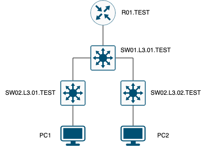

University: [ITMO University](https://itmo.ru/ru/)  
Faculty: [FICT](https://fict.itmo.ru)  
Course: [Introduction in routing](https://github.com/itmo-ict-faculty/introduction-in-routing)  
Year: 2025/2026  
Group: K3323  
Author: Ivanova Ekaterina Andreevna  
Lab: Lab1  
Date of creation: 07.09.2025  
Date of finish:  

## Laboratory Work No. 1: "Installing ContainerLab and Deploying a Test Communication Network"

### Helpful sources
  - [Simple deployment of a container-based network lab](https://habr.com/ru/articles/682974/)
    
### Objective

Become familiar with the ContainerLab tool, study the operation of VLANs, IP addressing, and related concepts

### Tasks
  1. Build a three-tier enterprise communication network in ContainerLab
  2. Configure IP addresses on interfaces and set up two VLANs on the PC
  3. Create two DHCP servers on the central router within the previously created VLANs to distribute IP addresses
  4. Configure device hostnames and change logins and passwords

### Procedure


#### Preliminary Setup

- Install `Docker` and start an engine 
  [Manual for Ubuntu](https://docs.docker.com/engine/install/ubuntu/)  


- Install `make`
    ```commandline
    # sudo apt install make
    # make --version
    ```

- Clone `hellt/vrnetlab`
    ```commandline
    # git clone https://github.com/srl-labs/vrnetlab.git
    ```
- Copy to `vrnetlab/mikrotik/routeros` VDM with MikroTik RouterOS
    ```commandline
    # scp ~/Downloads/chr-6.47.9.vmdk {user}@{server}:~/vrnetlab/mikrotik/routeros
    ```
- Create an image
    ```commandline
    # make docker-image
    ```
- Install ContainerLab
    ```commandline
    curl -sL https://containerlab.dev/setup | sudo -E bash -s "all"
    ```
- To enable sudo-less docker command execution run 
    ```commandline
    newgrp docker
    ```

#### Main part

It is required to build a three-tier enterprise network, as shown in Picture 1, using ContainerLab




### Conclusion


