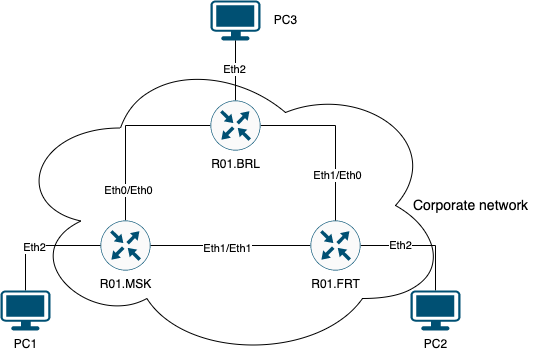

University: [ITMO University](https://itmo.ru/ru/)  
Faculty: [FICT](https://fict.itmo.ru)  
Course: [Introduction in routing](https://github.com/itmo-ict-faculty/introduction-in-routing)  
Year: 2025/2026  
Group: K3323  
Author: Ivanova Ekaterina Andreevna  
Lab: Lab2  
Date of creation:    
Date of finish:  

## Лабораторная работ №2 "Эмуляция распределенной корпоративной сети связи, настройка статической маршрутизации между филиалами"

### Описание
В данной лабораторной работе вы первый раз познакомитесь с компанией 
"RogaIKopita Games" LLC которая занимается разработкой мобильных игр с офисами в 
Москве, Франкфурте и Берлине. Для обеспечения работы своих офисов "RogaIKopita Games" 
вам как сетевому инженеру необходимо установить 3 роутера, назначить на них 
IP адресацию и поднять статическую маршрутизацию. В результате работы сотрудник из 
Москвы должен иметь возможность обмениваться данными с сотрудником из Франкфурта 
или Берлина и наоборот.

### Цель работы
Ознакомиться с принципами планирования IP адресов, настройке статической маршрутизации и сетевыми функциями устройств.

### Задачи
1. Сделать сеть связи в трех геораспределенных офисах "RogaIKopita Games" 
изображенную на рисунке в ContainerLab. 
Необходимо создать все устройства указанные на схеме и соединения между ними.
2. Настроить IP адреса на интерфейсах.
3. Создать DHCP сервера на роутерах в сторону клиентских устройств
4. Настроить статическую маршрутизацию
5. Настроить имена устройств, сменить логины и пароли

### Ход работы

### Conclusion
