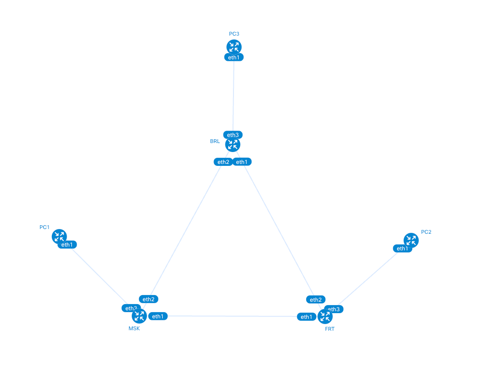

University: [ITMO University](https://itmo.ru/ru/)  
Faculty: [FICT](https://fict.itmo.ru)  
Course: [Introduction in routing](https://github.com/itmo-ict-faculty/introduction-in-routing)  
Year: 2025/2026  
Group: K3323  
Author: Ivanova Ekaterina Andreevna  
Lab: Lab2  
Date of creation:    
Date of finish:  

## Лабораторная работ №2 "Эмуляция распределенной корпоративной сети связи, настройка статической маршрутизации между филиалами"

### Описание
В данной лабораторной работе вы первый раз познакомитесь с компанией 
"RogaIKopita Games" LLC которая занимается разработкой мобильных игр с офисами в 
Москве, Франкфурте и Берлине. Для обеспечения работы своих офисов "RogaIKopita Games" 
вам как сетевому инженеру необходимо установить 3 роутера, назначить на них 
IP адресацию и поднять статическую маршрутизацию. В результате работы сотрудник из 
Москвы должен иметь возможность обмениваться данными с сотрудником из Франкфурта 
или Берлина и наоборот

### Цель работы
Ознакомиться с принципами планирования IP адресов, настройке статической маршрутизации и сетевыми функциями устройств

### Задачи
1. Сделать сеть связи в трех геораспределенных офисах "RogaIKopita Games" 
изображенную на рисунке в ContainerLab
Необходимо создать все устройства указанные на схеме и соединения между ними.
2. Настроить IP адреса на интерфейсах
3. Создать DHCP сервера на роутерах в сторону клиентских устройств
4. Настроить статическую маршрутизацию
5. Настроить имена устройств, сменить логины и пароли


### Ход работы

#### Развертывание топологии и настройка IP-адресации
Создаем сеть из трех роутеров (MSK, FRT, BRL) и трех клиентских ПК и назначаем IP-адреса (сети 172.16.0.0/30 для линков 
между роутерами и 10.10.0.0/24 для клиентских сегментов)

#### Настройка DHCP
На каждом роутере создаем DHCP-сервер для автоматической выдачи IP-адресов клиентским ПК в соответствующем офисе

Конфигурация роутера MSK:
```commandline
/system identity
set name=MSK

/user
add name=kate password=123 group=full

/ip address
add address=172.16.1.1/30 interface=ether2
add address=172.16.4.1/30 interface=ether3
add address=10.10.10.1/24 interface=ether4

/ip pool
add name=dhcp_pool_msk ranges=10.10.10.100-10.10.10.200

/ip dhcp-server
add name=dhcp_msk interface=ether4 address-pool=dhcp_pool_msk
enable dhcp_msk

/ip dhcp-server network
add address=10.10.10.0/24 gateway=10.10.10.1

/ip route
add dst-address=10.10.20.0/24 gateway=172.16.1.2
add dst-address=10.10.30.0/24 gateway=172.16.4.2
```

#### Настройка маршрутизации
Пропишем статические маршруты на всех роутерах для обеспечения связности между сетями офисов

Будем использовать один конфигурационный файл для всех компьютеров, так как настройки идентичны
```commandline
#!/bin/sh

ip route del default via 172.12.12.1 dev eth0
udhcpc -i eth1
```

#### Схема сети
Создадим схему созданной сети командой 
```commandline
clab graph -t tplg2.clab.yml
```


Отлично, граф соответствует схеме из задания 

#### Проверка связности
Подключимся к PC1 и попробуем отправить пинг на PC2
```commandline
docker exec -it clab-tplg2-PC1 sh
```

```commandline
ping 10.10.20.200 -c 3
PING 10.10.20.200 (10.10.20.200): 56 data bytes
64 bytes from 10.10.20.200: seq=0 ttl=62 time=2.037 ms
64 bytes from 10.10.20.200: seq=1 ttl=62 time=1.953 ms
64 bytes from 10.10.20.200: seq=2 ttl=62 time=1.885 ms

--- 10.10.20.200 ping statistics ---
3 packets transmitted, 3 packets received, 0% packet loss
round-trip min/avg/max = 1.885/1.958/2.037 ms
```
Теперь отправим пинг с PC2 на PC3

```commandline
docker exec -it clab-tplg2-PC2 sh
```

```commandline
ping 10.10.20.200 -c 3
PING 10.10.20.200 (10.10.20.200): 56 data bytes
64 bytes from 10.10.20.200: seq=0 ttl=64 time=0.277 ms
64 bytes from 10.10.20.200: seq=1 ttl=64 time=0.131 ms
64 bytes from 10.10.20.200: seq=2 ttl=64 time=0.129 ms

--- 10.10.20.200 ping statistics ---
3 packets transmitted, 3 packets received, 0% packet loss
round-trip min/avg/max = 0.129/0.179/0.277 ms
```

Ну и пинг с PС3 на PC1

```commandline
docker exec -it clab-tplg2-PC3 sh
```

```commandline
ping 10.10.10.200 -c 3
PING 10.10.10.200 (10.10.10.200): 56 data bytes
64 bytes from 10.10.10.200: seq=0 ttl=62 time=2.988 ms
64 bytes from 10.10.10.200: seq=1 ttl=62 time=1.700 ms
64 bytes from 10.10.10.200: seq=2 ttl=62 time=1.824 ms

--- 10.10.10.200 ping statistics ---
3 packets transmitted, 3 packets received, 0% packet loss
round-trip min/avg/max = 1.700/2.170/2.988 ms
```
### Вывод
В ходе выполнения работы были успешно развернуты все предусмотренные схемой устройства, выполнена настройка IP-адресации
на интерфейсах, 
организованы DHCP-серверы для клиентских устройств и настроена статическая маршрутизация между роутерами

Таким образом,
была достигнута поставленная цель - создание сети связи для трех геораспределенных офисов компании "RogaIKopita Games"

