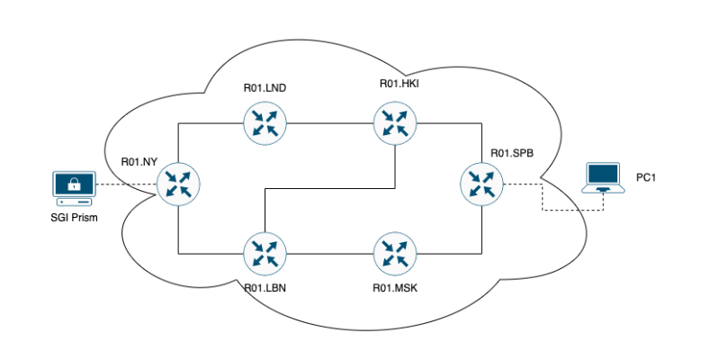
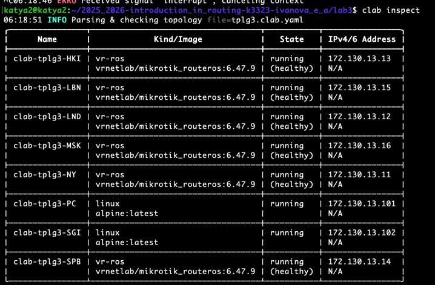
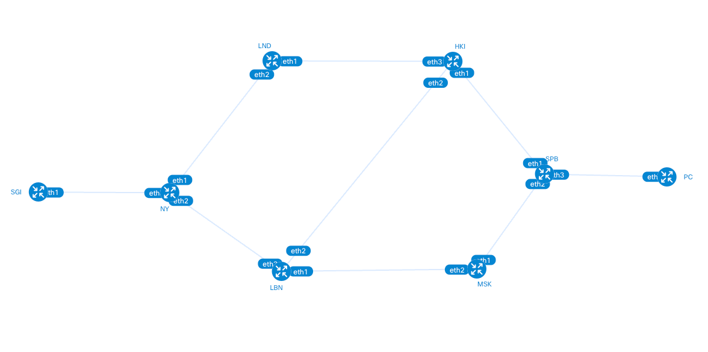
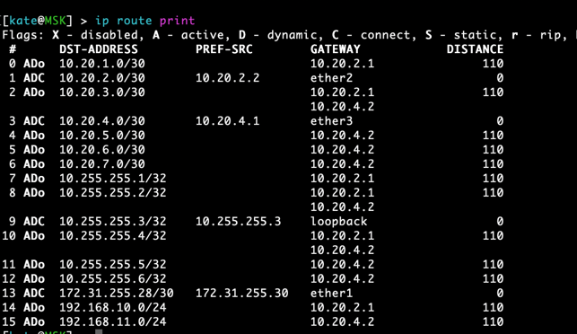
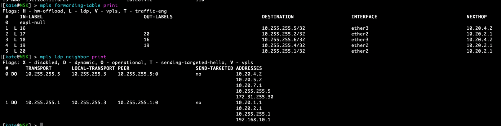
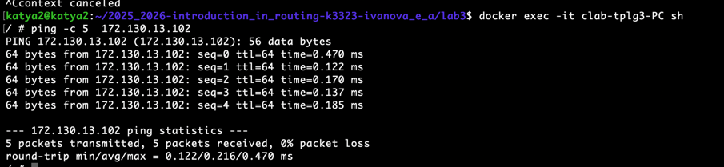

University: [ITMO University](https://itmo.ru/ru/)  
Faculty: [FICT](https://fict.itmo.ru)  
Course: [Introduction in routing](https://github.com/itmo-ict-faculty/introduction-in-routing)  
Year: 2025/2026  
Group: K3323  
Author: Ivanova Ekaterina Andreevna  
Lab: Lab3  
Date of creation:    
Date of finish:  

## Лабораторная работ №3 "Эмуляция распределенной корпоративной сети связи, настройка OSPF и MPLS, организация первого EoMPLS"

### Описание
Наша компания "RogaIKopita Games" с прошлой лабораторной работы выросла до серьезного игрового 
концерна, ещё немного и они выпустят свой ответ Genshin Impact - 
Allmoney Impact. И вот для этой задачи они купили небольшую, 
но очень старую студию "Old Games" из Нью Йорка, при поглощении 
выяснилось что у этой студии много наработок в области компьютерной графики и совет 
директоров "RogaIKopita Games" решил взять эти наработки на вооружение. К сожалению исходники 
лежат на сервере "SGI Prism", в Нью-Йоркском офисе никто им пользоваться не умеет, а из-за 
короновируса сотрудники офиса из Санкт-Петерубурга не могут добраться в Нью-Йорк, 
чтобы забрать данные из "SGI Prism". Ваша задача подключить Нью-Йоркский офис к общей IP/MPLS сети и организовать 
EoMPLS между "SGI Prism" и компьютером инженеров в Санк-Петербурге.

### Цель работы
Изучить протоколы OSPF и MPLS, механизмы организации EoMPLS.

### Задачи
1. Cделать IP/MPLS сеть связи для "RogaIKopita Games" изображенную на рисунке 1 в ContainerLab. Необходимо создать все 
устройства указанные на схеме и соединения между ними.
2. Настроить IP адреса на интерфейсах
3. Настроить OSPF и MPLS 
4. Настроить EoMPLS
5. Назначить адресацию на контейнеры, связанные между собой EoMPLS
6. Настроить имена устройств, сменить логины и пароли



### Ход работы

Настроим маршрутизатор на примере MSK

#### Базовая настройка устройства и создание пользователя
```commandline
/system identity set name=MSK

/user add name=kate password=123 group=full
/set admin disabled=yes
```

#### IP-адресация на интерфейсах
```commandline
/ip address add address=10.20.2.2/30 interface=ether2
/ip address add address=10.20.4.1/30 interface=ether3
```

#### Loopback интерфейс
```commandline
/interface bridge add name=loopback
/ip address add address=10.255.255.3/32 interface=loopback network=10.255.255.3
```

#### Настройка OSPF
```commandline
/routing ospf instance add name=inst router-id=10.255.255.3
/routing ospf area add name=backbonev2 area-id=0.0.0.0 instance=inst

/routing ospf network add area=backbonev2 network=10.20.2.0/30
/routing ospf network add area=backbonev2 network=10.20.4.0/30
/routing ospf network add area=backbonev2 network=10.255.255.3/32
```

#### Настройка MPLS
```commandline
/mpls ldp set lsr-id=10.255.255.3
/mpls ldp set enabled=yes transport-address=10.255.255.3
```

#### Настройка LDP-фильтров
```commandline
/mpls ldp advertise-filter add prefix=10.255.255.0/24 advertise=yes
/mpls ldp advertise-filter add advertise=no

/mpls ldp accept-filter add prefix=10.255.255.0/24 accept=yes
/mpls ldp accept-filter add accept=no

/mpls ldp interface add interface=ether2
/mpls ldp interface add interface=ether3
```

Теперь можем развернуть нашу топологию


#### Схема сети
Создадим схему созданной сети командой 
```commandline
clab graph -t tplg3.clab.yaml
```


Отлично, граф соответствует схеме из задания 

#### Проверка связности

Проверяем динамическую маршрутизацию с R01 MSK


Проверяем MPLS


Отправим пинг с PC на SGI


### Вывод
В ходе лабораторной работы была произведена базовая настройка сетевого оборудования: 
присвоено имя устройству, создан локальный пользователь и отключена стандартная учетная запись admin для повышения безопасности. 
Настроена динамическая маршрутизация OSPF с использованием loopback интерфейса в качестве Router-ID, а также активирован протокол LDP с 
фильтрацией для организации MPLS-коммутации в сети. Выполненные настройки создают основу для дальнейшего развертывания 
сервисов EoMPLS и обеспечения связности между сегментами сети согласно топологии лабораторного стенда