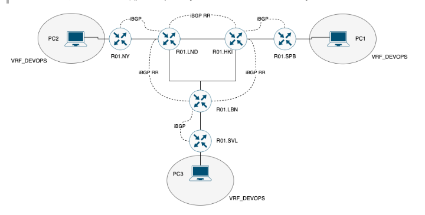
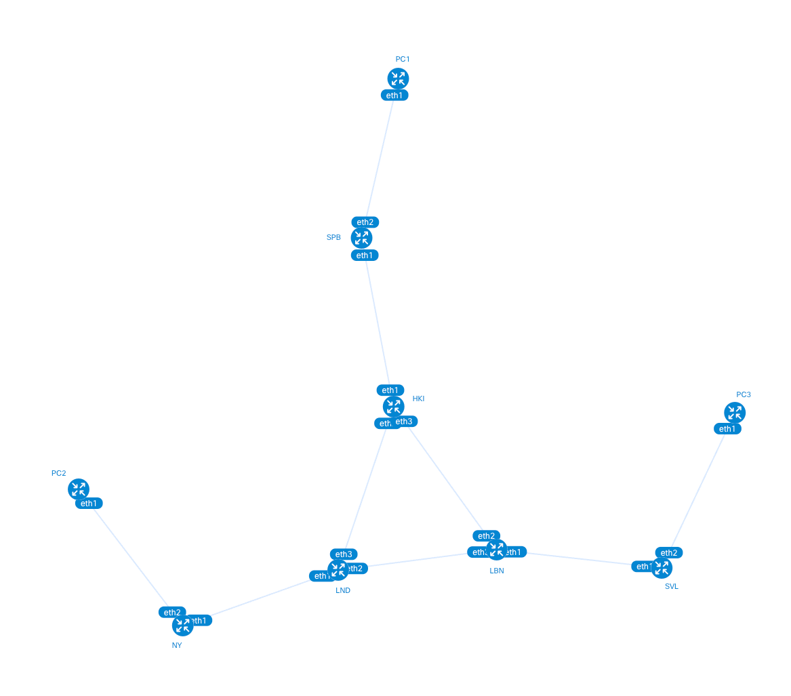
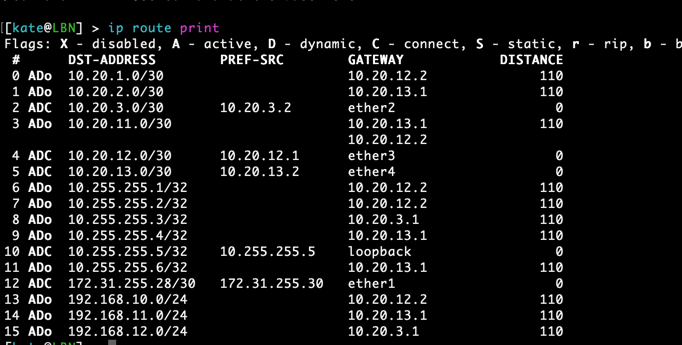
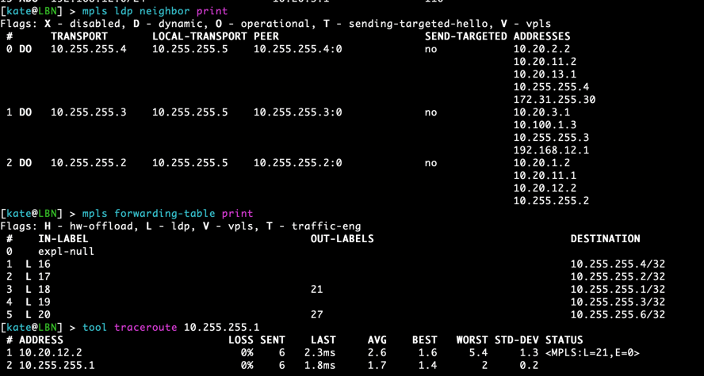
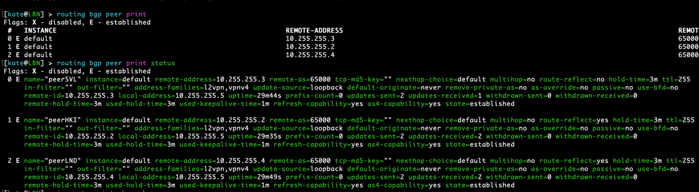

University: [ITMO University](https://itmo.ru/ru/)  
Faculty: [FICT](https://fict.itmo.ru)  
Course: [Introduction in routing](https://github.com/itmo-ict-faculty/introduction-in-routing)  
Year: 2025/2026  
Group: K3323  
Author: Ivanova Ekaterina Andreevna  
Lab: Lab4  
Date of creation:    
Date of finish:  

## Лабораторная работ №4 "Эмуляция распределенной корпоративной сети связи, настройка iBGP, организация L3VPN, VPLS"

### Описание
Компания "RogaIKopita Games" выпустила игру "Allmoney Impact", нагрузка на арендные сервера возрасли и вам поставлена 
задача стать LIR и организовать свою AS чтобы перенести все сервера игры на свою инфраструктуру. 
После организации вашей AS коллеги из отдела DEVOPS попросили вас сделать L3VPN между 3 офисами для служебных нужд. 
Данный L3VPN проработал пару недель и коллеги из отдела DEVOPS попросили вас сделать VPLS для служебных нужд.

### Цель работы
Изучить протоколы BGP, MPLS и правила организации L3VPN и VPLS.

### Задачи 
Вам необходимо сделать IP/MPLS сеть связи для "RogaIKopita Games" изображенную на рисунке 1 в ContainerLab. Необходимо создать все устройства указанные на схеме и соединения между ними.

- Помимо этого вам необходимо настроить IP адреса на интерфейсах.
- Настроить OSPF и MPLS.
- Настроить iBGP с route reflector кластером

И вот тут лабораторная работа разделяется на 2 части, в первой части вам надо настроить L3VPN, во второй настроить VPLS, но при этом менять топологию не требуется. Вы можете просто разобрать VRF и на их месте собрать VPLS.

Первая часть:
- Настроить iBGP RR Cluster.
- Настроить VRF на 3 роутерах.
- Настроить RD и RT на 3 роутерах.
- Настроить IP адреса в VRF.
- Проверить связность между VRF
- Настроить имена устройств, сменить логины и пароли.

Вторая часть:
- Разобрать VRF на 3 роутерах (или отвязать их от интерфейсов).
- Настроить VPLS на 3 роутерах.
- Настроить IP адресацию на PC1,2,3 в одной сети.
- Проверить связность.


### Ход работы

Назначаем IP-адреса на интерфейсы
```commandline
ip address
add address=10.20.1.1/30 interface=ether2
add address=192.168.10.1/24 interface=ether3
```

Настраиваем DHCP-сервер для динамического распределения адресов
```commandline
/ip pool
add name=dhcp-pool ranges=192.168.10.10-192.168.10.100
/ip dhcp-server
add address-pool=dhcp-pool disabled=no interface=ether3 name=dhcp-server
/ip dhcp-server network
add address=192.168.10.0/24 gateway=192.168.10.1
```

#### Настройка OSPF
Создаем виртуальный интерфейс loopback
```commandline
/interface bridge
add name=loopback
/ip address
add address=10.255.255.1/32 interface=loopback network=10.255.255.1
```
Loopback-интерфейс используется как router-id в OSPF и не отключается автоматически.

Настраиваем экземпляр OSPF и сеть:
```commandline
/routing ospf instance
add name=inst router-id=10.255.255.1
/routing ospf area
add name=backbonev2 area-id=0.0.0.0 instance=inst
/routing ospf network
add area=backbonev2 network=10.20.1.0/30
add area=backbonev2 network=192.168.10.0/24
add area=backbonev2 network=10.255.255.1/32
```

#### Настройка MPLS
Включаем протокол LDP с использованием loopback-адреса
```commandline
/mpls ldp
set lsr-id=10.255.255.1
set enabled=yes transport-address=10.255.255.1
/mpls ldp interface
add interface=ether2
```
LSR-ID и transport-address соответствуют адресу loopback

#### Настройка iBGP
```commandline
/routing bgp instance
set default as=65000 router-id=10.255.255.1
/routing bgp peer
add name=peerHKI remote-address=10.255.255.2 address-families=l2vpn,vpnv4 remote-as=65000 update-source=loopback route-reflect=no
/routing bgp network
add network=10.255.255.0/24
```
Сессия iBGP установлена через loopback с соседним PE-роутером для обмена VPNv4 и L2VPN-маршрутами.
Анонсирована сеть ядра MPLS

#### Настройка VRF на внешних роутерах
Создаем VRF для L3VPN
```commandline
/interface bridge
add name=vpn
/interface bridge port
add interface=ether3 bridge=vpn
/interface vpls bgp-vpls
add bridge=vpn export-route-targets=65000:100 import-route-targets=65000:100 name=vpn route-distinguisher=65000:100 site-id=1
/ip address
add address=10.100.1.1/24 interface=vpn
```
VRF использует мост br100 с RD/RT 65000:100. 
BGP-инстанс публикует маршруты в VPNv4

#### Настройка VPLS (вторая часть)
Обновляем MPLS для VPLS (включён ether3):

```commandline
/mpls ldp interface
add interface=ether2
add interface=ether3
```

Создаем мост для VPLS:

```commandline
/interface bridge
add name=vpn
/interface bridge port
add interface=ether3 bridge=vpn
/interface vpls bgp-vpls
add bridge=vpn export-route-targets=65000:100 import-route-targets=65000:100 name=vpn route-distinguisher=65000:100 site-id=1
/ip address
add address=10.100.1.1/24 interface=vpn
```

Настраиваем DHCP для VPN-сети (на роутере SPB):

```commandline
/ip pool
add name=vpn-dhcp-pool ranges=10.100.1.100-10.100.1.254
/ip dhcp-server
add address-pool=vpn-dhcp-pool disabled=no interface=vpn name=dhcp-vpls
/ip dhcp-server network
add address=10.100.1.0/24 gateway=10.100.1.1
```

VRF удалён; ether3 подключён к общему L2-домену VPLS

#### Схема сети
Создадим схему созданной сети командой 
```commandline
clab graph -t tplg42.clab.yaml
```


Отлично, граф соответствует схеме из задания

#### Проверка связности

#### OSPF
`ip route print`



#### MPLS
```commandline
mpls forwarding-table print
mpls ldp neighbor print
tool traceroute 10.255.255.1
```


#### iBGP
```commandline
routing bgp peer print
ip route print where bgp
```


### Вывод
Итогом лабораторной работы стала полностью функционирующая MPLS-сеть. 
Помимо базовой настройки IP-связности и MPLS, особое внимание было уделено организации масштабируемого управления 
маршрутами через iBGP и Route Reflector.
Выполненные настройки подтвердили работоспособность двух типов услуг: многоточечного соединения на втором уровне 
(VPLS) и виртуальных частных сетей на третьем уровне (L3VPN), что демонстрирует гибкость MPLS-архитектуры.

